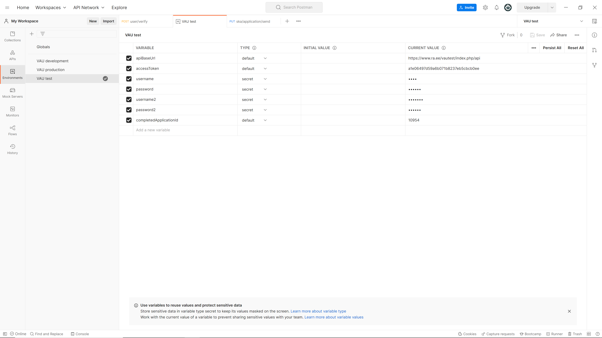

# Postman

Kui arendaja on [Postman](https://www.postman.com/)-i registreeritud kasutaja, on võimalik jagada temaga kollektsiooni kõigist selle API päringutest. Ligipääsu saamiseks tuleb saata taotlus e-kirjaga aadressil admin.vau@ra.ee

Kollektsiooni jagamine toimub _Via JSON Link_. Pärast kollektsioonile ligipääsu saamist tuleb luua n-ö keskkond.

<figure><figcaption></figcaption></figure>

Muutujaid `username` ja `password` __ kasutab SKA mooduli kaustas olev [user/verify](../ueldised-paeringud/kasutaja.md).

Muutujaid `username2` ja `password2` kasutab RA mooduli kaustas olev [user/verify](../ueldised-paeringud/kasutaja.md).

Niisiis kui[ VAU administraator andis su kasutajale ligipääsu](../juurdepaeaesutaotlus.md) RA moodulile, pead sa oma kasutajanime ja salasõna lisama `username2` ja `password2` väärtuseks.

Kollektsiooni kasutamisel tuleb esimese asjana jooksutada [`user/verify`](../ueldised-paeringud/kasutaja.md) päringut ja kopeerida vastusest `accessToken` väärtus keskkonna samanimelise muutuja väärtuseks. Kui _token_ aegub, tuleb seda tegevust korrata.


Päringute gruppe saab käivitada suvalises järjekorras, aga grupi sees tuleks päringuid käivitada järjest. Näiteks SKA mooduli`application/create`enne ja`application/update` pärast ja`application/delete`kõige lõpus. Siis ei ole vaja päringutes identifikaatoreid käsitsi muuta. Taotluse loomise päring omistab tagastatud uue taotluse ID väärtuse muutujale, mida järgnevad päringud kasutavad.

