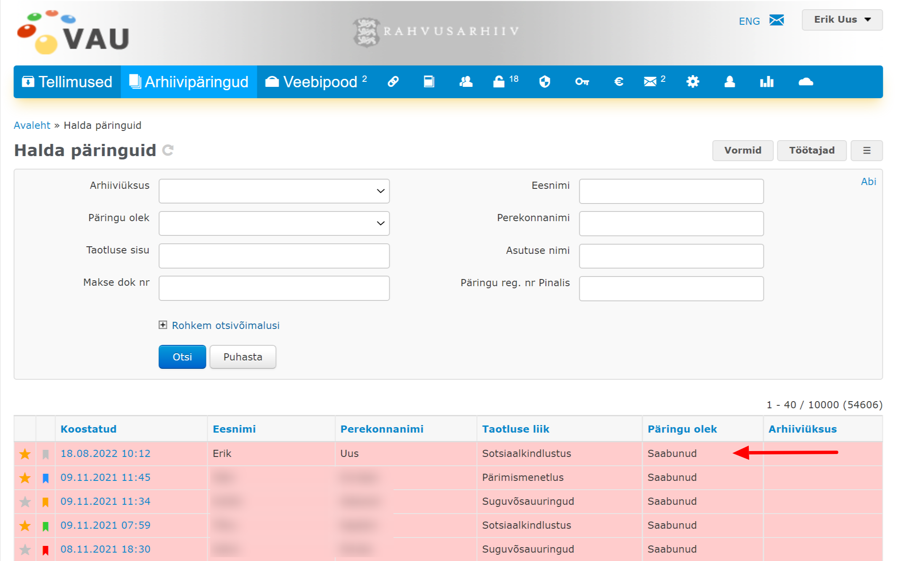

# Kiirjuhend


See kiirjuhend seletab näidete varal API põhilisi funktsioone. Me ei süvene siin detailidesse ega kommenteeri päringute kõiki parameetreid, kuna need on põhjalikult dokumenteeritud järgnevatel lehekülgedel. Siin me loome kiirelt uue üksuse ja lisame sinna uue töötaja. Seejärel loome selle töötaja nimel uue taotluse, lisame sellele faili ja saadame taotluse Rahvusarhiivi. Me pärime, mis olekus on taotluse menetlemine, ja küsime taotluse detailvaate. Lõpuks pärime me taotluse vastuse. Kõige selle juures vaatame me paralleelselt, kuidas need tegevused kajastuvad veebirakenduse kasutajaliideses.



Siin ja edaspidi, kui räägitakse "veebirakendusest", peetakse silmas Rahvusarhiivi loodud ja Rahvusarhiivi domeenis asuvat rakendust https://www.ra.ee/eteatis/, mida Sotsiaalkindlustusameti töötajad on saanud kasutada alates 2013. aastast, et taotleda Rahvusarhiivilt e-arhiiviteatisi. Sellest rakendusest on pikemalt juttu sissejuhatuses.


## Ettevalmistus

Alustamiseks peab esiteks omama Rahvusarhiivi kasutajakontot, millele administraator on andnud õiguse kasutada e-arhiiviteatise API-moodulit. Teiseks peab teadma muutuja \{{apiBaseUrl\}} väärtust ehk API juuraadressi. &#x20;


[juurdepaeaesutaotlus.md](juurdepaeaesutaotlus.md)



[juuraadress.md](juuraadress.md)


Selles kiirjuhendis on kasutatud kontot, mille kasutajanimi on "erik" ja API testkeskkonda, mille juuraadess on "https://www.ra.ee/vautest/index.php/api".

## Tokeni pärimine

Kõigile päringutele tuleb ühe parameetrina lisada juurde ajutiselt kehtiv kood ehk _token_. Kui _token_ puudub või on aegunud, päring ei õnnestu.

_Tokeni_ saamiseks käivitame me järgmise päringu:

```shell
curl --location --request POST '{{apiBaseUrl}}/user/verify' \
--form 'username="erik"' \
--form 'password="•••••••"'
```


See ja kõik järgnevad päringu näited on cUrl formaadis.


Päringu vastuseks on JSON:

```json
{
    "responseStatus": "ok",
    "userId": 3,
    "userFirstname": "Erik",
    "userLastname": "Uus",
    "userEmail": "erik.uus@ra.ee",
    "accessToken": "71e0d98f1ab52c225d655359190b6844",
    "tokenLifetime": 3600,
    "requestUnixTime": 1660724872
}
```

## Üksuse loomine

Kasutades eelnevas vastuses saadud _tokenit_, käivitame päringu:


```shell
curl --location --request POST '{{apiBaseUrl}}/ska/department/create?token=71e0d98f1ab52c225d655359190b6844' \
--data-raw '{
    "name": "Test osakond",
    "address": "Tammsaare 8-25, Tartu",
    "zip": "51006",
    "email": "erik.uus@ra.ee",
    "phone": "+372 5322 5388"
}'
```


Päringu vastuseks on JSON:

```json
{
    "responseStatus": "ok",
    "departmentId": 36
}
```

Veebirakenduse näeb loodud osakond välja nii:

.png>)

## Töötaja loomine

Kasutades eelnevatest vastustest saadud andmeid (_token, departmentId_), käivitame päringu:


```shell
curl --location --request POST '{{apiBaseUrl}}/ska/employee/create?token=71e0d98f1ab52c225d655359190b6844' \
--data-raw '{
    "firstname": "Erik",
    "lastname": "Uus",
    "email": "erik.uus@ra.ee",
    "phone": "+372 5322 5388",
    "department_id": 36
}'
```


Päringu vastuseks on JSON:

```json
{
    "responseStatus": "ok",
    "employeeId": 310
}
```

Veebirakenduse näeb loodud töötaja välja nii:

.png>)

## Taotluse loomine

Kasutades eelnevatest vastustest saadud andmeid (_token, employeeId, departmentId_), käivitame päringu:

```shell
curl --location --request POST '{{apiBaseUrl}}/ska/application/create?token=71e0d98f1ab52c225d655359190b6844' \
--data-raw '{
    "Application": {
        "applicant_firstname": "Erik",
        "applicant_lastname": "Uus",
        "applicant_birthday": "30.07.1973",
        "applicant_address": "Tammsaare 8-25",
        "applicant_id_nr": "37307302715",
        "applicant_zip": "51006",
        "applicant_phone": "+37253225388",
        "applicant_email": "erik.uus@gmail.com",
        "applicant_names_info": "Uks, Uss",
        "applicant_department_id": 36,
        "study_comments": "Märkused, täiendused",
        "work_pension_info": "Õigus sooduspensionile, vajalike tingimuste kirjeldus",
        "work_comments": "Märkused, täiendused",
        "farm_info": "Maakond, vald, talu nimi, aeg",
        "military_info": "Kirjeldus; Eesti Kaitseväes teenimise puhul märkida väeosa ja teenimise aeg, Saksa sõjaväes teenimise puhul kõik teadaolevad andmed",
        "rear_info": "Kirjeldus; kellega koos tagalasse saadeti (andmed vanemate kohta) ja märkida kõik teadaolevad andmed",
        "prison_info": "Kirjeldus; kellega koos laagrisse/asumisele saadeti (andmed vanemate kohta), millal ja kelle poolt karistatud, karistuse kandmise aeg ja koht, vabanemise aeg",
        "work_camp_info": "Laagri nimetus, kinnipidamise ja vabastamise aeg",
        "ww2_estonia_info": "Kirjeldus; kellega koos toodi (andmed vanemate kohta), toomise aeg ja koht, laagrite nimed ja kinnipidamisaeg, kuhu suunati elama ja tööle",
        "ww2_germany_info": "Kirjeldus; kellega koos saadeti (andmed vanemate kohta), kust ja millal saadeti, laagrite nimed, töökohad Saksamaal, Eestisse naasmise aeg ja koht",
        "other_comments": "Märkused, täiendused",
        "taxnotice_delivery_method": "DELIVERY_EMAIL",
        "copy_delivery_method": "DELIVERY_EMAIL",
        "employee_id": 310,
        "department_id": 36
    },
    "Study": [
        {
            "institution": "Nõo Keskkool",
            "period": "1980 - 1991",
            "specialty": ""
        },
        {
            "institution": "Tartu Ülikool",
            "period": "1991 - 1995",
            "specialty": "usuteadus"
        }
    ],
    "Work": [
        {
            "institution": "Rahvusarhiiv",
            "period": "2006 - 2022",
            "specialty": "programmeerija"
        },
        {
            "institution": "Babahh OÜ",
            "period": "2014 - 2018",
            "specialty": "programmeerija"
        }
    ]
}'
```

Päringu vastuseks on JSON:

```json
{
    "responseStatus": "ok",
    "applicationId": 16610
}
```

Veebirakenduse näeb loodud taotlus välja nii:

.png>)


Pane tähele, et ülaltoodud näites on mitmete väljade väärtuseks pandud väljade nimed. Seda on tehtud ainult seepärast, et näite koostamine oleks lihtsam. Samal põhjusel on dokumentatsiooni autor märkinud nii taotleja kui töötaja andmeteks oma isikuandmed.


## Faili lisamine

Kasutades eelnevatest vastustest saadud andmeid (_token, employeeId, applicationId_), käivitame päringu:

<pre class="language-shell"><code class="lang-shell"><strong>curl --location --request POST '{{apiBaseUrl}}/ska/file/create?token=71e0d98f1ab52c225d655359190b684' \
</strong>--data-raw '{
    "application_id": 16610,
    "employee_id": 310,
    "file_name": "test.jpg",shell
    "file_content": "/9j/4AAQSkZJRgABAQAAAQABAAD//gAXR2VuZXJhdGVkIGJ5IElJUEltYWdl/+AXCzw/eHBhY2tldCBiZWdpbj0n77u/JyBpZD0nVzVNME1wQ2VoaUh6cmVTek5UY3prYzlkJz8+Cjx4OnhtcG1ldGEgeG1sbnM6eD0nYWRvYmU6bnM6bWV0YS8nIHg6eG1wdGs9J1hNUCB0b29sa2l0IDMuMC0yOCwgZnJhbWV3b3JrIDEuNic+CjxyZGY6UkRGIHhtbG5zOnJkZj0naHR0cDovL3d3dy53My5vcmcvMTk5OS8wMi8yMi1yZGYtc3ludGF4LW5zIycgeG1sbnM6aVg9J2h0dHA6Ly9ucy5hZG9iZS5jb20vaVgvMS4wLyc+CgogPHJkZjpEZXNjcmlwdGlvbiByZGY6YWJvdXQ9J3V1aWQ6YzYyNWI4YWQtN2ZkZC0xMWRkLWI1YTQtODkwYjkzMzMwMjBmJwogIHhtbG5zOnBkZj0naHR0cDovL25zLmFkb2JlLmNvbS9wZGYvMS4zLyc+CiA8L3JkZjpEZXNjcmlwdGlvbj4KCiA8cmRmOkRlc2NyaXB0aW9uIHJkZjphYm91dD0ndXVpZDpjNjI1YjhhZC03ZmRkLTExZGQtYjVhNC04OTBiOTMzMzAyMGYnCiAgeG1sbnM6cGhvdG9zaG9wPSdodHRwOi8vbnMuYWRvYmUuY29tL3Bob3Rvc2hvcC8xLjAvJz4KICA8cGhvdG9zaG9wOkhpc3Rvcnk+PC9waG90b3Nob3A6SGlzdG9yeT4KIDwvcmRmOkRlc2NyaXB0aW9uPgoKIDxyZGY6RGVzY3JpcHRpb24gcmRmOmFib3V0PSd1dWlkOmM2MjViOGFkLTdmZGQtMTFkZC1iNWE0LTg5MGI5MzMzMDIwZicKICB4bWxuczp0aWZmPSdodHRwOi8vbnMuYWRvYmUuY29tL3RpZmYvMS4wLyc+CiAgPHRpZmY6WFJlc29sdXRpb24+MzAwLzE8L3RpZmY6WFJlc29sdXRpb24+CiAgPHRpZmY6WVJlc29sdXRpb24+MzAwLzE8L3RpZmY6WVJlc29sdXRpb24+CiAgPHRpZmY6UmVzb2x1dGlvblVuaXQ+MjwvdGlmZjpSZXNvbHV0aW9uVW5pdD4KIDwvcmRmOkRlc2NyaXB0aW9uPgoKIDxyZGY6RGVzY3JpcHRpb24gcmRmOmFib3V0PSd1dWlkOmM2MjViOGFkLTdmZGQtMTFkZC1iNWE0LTg5MGI5MzMzMDIwZicKICB4bWxuczp4YXA9J2h0dHA6Ly9ucy5hZG9iZS5jb20veGFwLzEuMC8nPgogIDx4YXA6Q3JlYXRlRGF0ZT4yMDA4LTA5LTExVDEwOjM5OjE3KzAyOjAwPC94YXA6Q3JlYXRlRGF0ZT4KICA8eGFwOk1vZGlmeURhdGU+MjAwOC0wOS0xMVQxMTo0NzowMiswMjowMDwveGFwOk1vZGlmeURhdGU+CiAgPHhhcDpNZXRhZGF0YURhdGU+MjAwOC0wOS0xMVQxMTo0NzowMiswMjowMDwveGFwOk1ldGFkYXRhRGF0ZT4KICA8eGFwOkNyZWF0b3JUb29sPkFkb2JlIFBob3Rvc2hvcCBDUyBXaW5kb3dzPC94YXA6Q3JlYXRvclRvb2w+CiA8L3JkZjpEZXNjcmlwdGlvbj4KCiA8cmRmOkRlc2NyaXB0aW9uIHJkZjphYm91dD0ndXVpZDpjNjI1YjhhZC03ZmRkLTExZGQtYjVhNC04OTBiOTMzMzAyMGYnCiAgeG1sbnM6eGFwTU09J2h0dHA6Ly9ucy5hZG9iZS5jb20veGFwLzEuMC9tbS8nPgogIDx4YXBNTTpEb2N1bWVudElEPmFkb2JlOmRvY2lkOnBob3Rvc2hvcDpjNjI1YjhhYy03ZmRkLTExZGQtYjVhNC04OTBiOTMzMzAyMGY8L3hhcE1NOkRvY3VtZW50SUQ+CiA8L3JkZjpEZXNjcmlwdGlvbj4KCiA8cmRmOkRlc2NyaXB0aW9uIHJkZjphYm91dD0ndXVpZDpjNjI1YjhhZC03ZmRkLTExZGQtYjVhNC04OTBiOTMzMzAyMGYnCiAgeG1sbnM6ZGM9J2h0dHA6Ly9wdXJsLm9yZy9kYy9lbGVtZW50cy8xLjEvJz4KICA8ZGM6Zm9ybWF0PmltYWdlL3RpZmY8L2RjOmZvcm1hdD4KICA8ZGM6ZGVzY3JpcHRpb24+CiAgIDxyZGY6QWx0PgogICAgPHJkZjpsaSB4bWw6bGFuZz0neC1kZWZhdWx0Jz48L3JkZjpsaT4KICAgPC9yZGY6QWx0PgogIDwvZGM6ZGVzY3JpcHRpb24+CiA8L3JkZjpEZXNjcmlwdGlvbj4KCjwvcmRmOlJERj4KPC94OnhtcG1ldGE+CiAgICAgICAgICAgICAgICAgICAgICAgICAgICAgICAgICAgICAgICAgICAgICAgICAgICAgICAgICAgICAgICAgICAgICAgICAgICAgICAgICAgICAgICAgICAgICAgICAgICAKICAgICAgICAgICAgICAgICAgICAgICAgICAgICAgICAgICAgICAgICAgICAgICAgICAgICAgICAgICAgICAgICAgICAgICAgICAgICAgICAgICAgICAgICAgICAgICAgICAgIAogICAgICAgICAgICAgICAgICAgICAgICAgICAgICAgICAgICAgICAgICAgICAgICAgICAgICAgICAgICAgICAgICAgICAgICAgICAgICAgICAgICAgICAgICAgICAgICAgICAgCiAgICAgICAgICAgICAgICAgICAgICAgICAgICAgICAgICAgICAgICAgICAgICAgICAgICAgICAgICAgICAgICAgICAgICAgICAgICAgICAgICAgICAgICAgICAgICAgICAgICAKICAgICAgICAgICAgICAgICAgICAgICAgICAgICAgICAgICAgICAgICAgICAgICAgICAgICAgICAgICAgICAgICAgICAgICAgICAgICAgICAgICAgICAgICAgICAgICAgICAgIAogICAgICAgICAgICAgICAgICAgICAgICAgICAgICAgICAgICAgICAgICAgICAgICAgICAgICAgICAgICAgICAgICAgICAgICAgICAgICAgICAgICAgICAgICAgICAgICAgICAgCiAgICAgICAgICAgICAgICAgICAgICAgICAgICAgICAgICAgICAgICAgICAgICAgICAgICAgICAgICAgICAgICAgICAgICAgICAgICAgICAgICAgICAgICAgICAgICAgICAgICAKICAgICAgICAgICAgICAgICAgICAgICAgICAgICAgICAgICAgICAgICAgICAgICAgICAgICAgICAgICAgICAgICAgICAgICAgICAgICAgICAgICAgICAgICAgICAgICAgICAgIAogICAgICAgICAgICAgICAgICAgICAgICAgICAgICAgICAgICAgICAgICAgICAgICAgICAgICAgICAgICAgICAgICAgICAgICAgICAgICAgICAgICAgICAgICAgICAgICAgICAgCiAgICAgICAgICAgICAgICAgICAgICAgICAgICAgICAgICAgICAgICAgICAgICAgICAgICAgICAgICAgICAgICAgICAgICAgICAgICAgICAgICAgICAgICAgICAgICAgICAgICAKICAgICAgICAgICAgICAgICAgICAgICAgICAgICAgICAgICAgICAgICAgICAgICAgICAgICAgICAgICAgICAgICAgICAgICAgICAgICAgICAgICAgICAgICAgICAgICAgICAgIAogICAgICAgICAgICAgICAgICAgICAgICAgICAgICAgICAgICAgICAgICAgICAgICAgICAgICAgICAgICAgICAgICAgICAgICAgICAgICAgICAgICAgICAgICAgICAgICAgICAgCiAgICAgICAgICAgICAgICAgICAgICAgICAgICAgICAgICAgICAgICAgICAgICAgICAgICAgICAgICAgICAgICAgICAgICAgICAgICAgICAgICAgICAgICAgICAgICAgICAgICAKICAgICAgICAgICAgICAgICAgICAgICAgICAgICAgICAgICAgICAgICAgICAgICAgICAgICAgICAgICAgICAgICAgICAgICAgICAgICAgICAgICAgICAgICAgICAgICAgICAgIAogICAgICAgICAgICAgICAgICAgICAgICAgICAgICAgICAgICAgICAgICAgICAgICAgICAgICAgICAgICAgICAgICAgICAgICAgICAgICAgICAgICAgICAgICAgICAgICAgICAgCiAgICAgICAgICAgICAgICAgICAgICAgICAgICAgICAgICAgICAgICAgICAgICAgICAgICAgICAgICAgICAgICAgICAgICAgICAgICAgICAgICAgICAgICAgICAgICAgICAgICAKICAgICAgICAgICAgICAgICAgICAgICAgICAgICAgICAgICAgICAgICAgICAgICAgICAgICAgICAgICAgICAgICAgICAgICAgICAgICAgICAgICAgICAgICAgICAgICAgICAgIAogICAgICAgICAgICAgICAgICAgICAgICAgICAgICAgICAgICAgICAgICAgICAgICAgICAgICAgICAgICAgICAgICAgICAgICAgICAgICAgICAgICAgICAgICAgICAgICAgICAgCiAgICAgICAgICAgICAgICAgICAgICAgICAgICAgICAgICAgICAgICAgICAgICAgICAgICAgICAgICAgICAgICAgICAgICAgICAgICAgICAgICAgICAgICAgICAgICAgICAgICAKICAgICAgICAgICAgICAgICAgICAgICAgICAgICAgICAgICAgICAgICAgICAgICAgICAgICAgICAgICAgICAgICAgICAgICAgICAgICAgICAgICAgICAgICAgICAgICAgICAgIAogICAgICAgICAgICAgICAgICAgICAgICAgICAgICAgICAgICAgICAgICAgICAgICAgICAgICAgICAgICAgICAgICAgICAgICAgICAgICAgICAgICAgICAgICAgICAgICAgICAgCiAgICAgICAgICAgICAgICAgICAgICAgICAgICAgICAgICAgICAgICAgICAgICAgICAgICAgICAgICAgICAgICAgICAgICAgICAgICAgICAgICAgICAgICAgICAgICAgICAgICAKICAgICAgICAgICAgICAgICAgICAgICAgICAgICAgICAgICAgICAgICAgICAgICAgICAgICAgICAgICAgICAgICAgICAgICAgICAgICAgICAgICAgICAgICAgICAgICAgICAgIAogICAgICAgICAgICAgICAgICAgICAgICAgICAgICAgICAgICAgICAgICAgICAgICAgICAgICAgICAgICAgICAgICAgICAgICAgICAgICAgICAgICAgICAgICAgICAgICAgICAgCiAgICAgICAgICAgICAgICAgICAgICAgICAgICAgICAgICAgICAgICAgICAgICAgICAgICAgICAgICAgICAgICAgICAgICAgICAgICAgICAgICAgICAgICAgICAgICAgICAgICAKICAgICAgICAgICAgICAgICAgICAgICAgICAgICAgICAgICAgICAgICAgICAgICAgICAgICAgICAgICAgICAgICAgICAgICAgICAgICAgICAgICAgICAgICAgICAgICAgICAgIAogICAgICAgICAgICAgICAgICAgICAgICAgICAgICAgICAgICAgICAgICAgICAgICAgICAgICAgICAgICAgICAgICAgICAgICAgICAgICAgICAgICAgICAgICAgICAgICAgICAgCiAgICAgICAgICAgICAgICAgICAgICAgICAgICAgICAgICAgICAgICAgICAgICAgICAgICAgICAgICAgICAgICAgICAgICAgICAgICAgICAgICAgICAgICAgICAgICAgICAgICAKICAgICAgICAgICAgICAgICAgICAgICAgICAgICAgICAgICAgICAgICAgICAgICAgICAgICAgICAgICAgICAgICAgICAgICAgICAgICAgICAgICAgICAgICAgICAgICAgICAgIAogICAgICAgICAgICAgICAgICAgICAgICAgICAgICAgICAgICAgICAgICAgICAgICAgICAgICAgICAgICAgICAgICAgICAgICAgICAgICAgICAgICAgICAgICAgICAgICAgICAgCiAgICAgICAgICAgICAgICAgICAgICAgICAgICAgICAgICAgICAgICAgICAgICAgICAgICAgICAgICAgICAgICAgICAgICAgICAgICAgICAgICAgICAgICAgICAgICAgICAgICAKICAgICAgICAgICAgICAgICAgICAgICAgICAgICAgICAgICAgICAgICAgICAgICAgICAgICAgICAgICAgICAgICAgICAgICAgICAgICAgICAgICAgICAgICAgICAgICAgICAgIAogICAgICAgICAgICAgICAgICAgICAgICAgICAgICAgICAgICAgICAgICAgICAgICAgICAgICAgICAgICAgICAgICAgICAgICAgICAgICAgICAgICAgICAgICAgICAgICAgICAgCiAgICAgICAgICAgICAgICAgICAgICAgICAgICAgICAgICAgICAgICAgICAgICAgICAgICAgICAgICAgICAgICAgICAgICAgICAgICAgICAgICAgICAgICAgICAgICAgICAgICAKICAgICAgICAgICAgICAgICAgICAgICAgICAgICAgICAgICAgICAgICAgICAgICAgICAgICAgICAgICAgICAgICAgICAgICAgICAgICAgICAgICAgICAgICAgICAgICAgICAgIAogICAgICAgICAgICAgICAgICAgICAgICAgICAgICAgICAgICAgICAgICAgICAgICAgICAgICAgICAgICAgICAgICAgICAgICAgICAgICAgICAgICAgICAgICAgICAgICAgICAgCiAgICAgICAgICAgICAgICAgICAgICAgICAgICAgICAgICAgICAgICAgICAgICAgICAgICAgICAgICAgICAgICAgICAgICAgICAgICAgICAgICAgICAgICAgICAgICAgICAgICAKICAgICAgICAgICAgICAgICAgICAgICAgICAgICAgICAgICAgICAgICAgICAgICAgICAgICAgICAgICAgICAgICAgICAgICAgICAgICAgICAgICAgICAgICAgICAgICAgICAgIAogICAgICAgICAgICAgICAgICAgICAgICAgICAgICAgICAgICAgICAgICAgICAgICAgICAgICAgICAgICAgICAgICAgICAgICAgICAgICAgICAgICAgICAgICAgICAgICAgICAgCiAgICAgICAgICAgICAgICAgICAgICAgICAgICAgICAgICAgICAgICAgICAgICAgICAgICAgICAgICAgICAgICAgICAgICAgICAgICAgICAgICAgICAgICAgICAgICAgICAgICAKICAgICAgICAgICAgICAgICAgICAgICAgICAgICAgICAgICAgICAgICAgICAgICAgICAgICAgIAo8P3hwYWNrZXQgZW5kPSd3Jz8+/9sAQwAIBgYHBgUIBwcHCQkICgwUDQwLCwwZEhMPFB0aHx4dGhwcICQuJyAiLCMcHCg3KSwwMTQ0NB8nOT04MjwuMzQy/9sAQwEJCQkMCwwYDQ0YMiEcITIyMjIyMjIyMjIyMjIyMjIyMjIyMjIyMjIyMjIyMjIyMjIyMjIyMjIyMjIyMjIyMjIy/8AAEQgAeACnAwEiAAIRAQMRAf/EAB8AAAEFAQEBAQEBAAAAAAAAAAABAgMEBQYHCAkKC//EALUQAAIBAwMCBAMFBQQEAAABfQECAwAEEQUSITFBBhNRYQcicRQygZGhCCNCscEVUtHwJDNicoIJChYXGBkaJSYnKCkqNDU2Nzg5OkNERUZHSElKU1RVVldYWVpjZGVmZ2hpanN0dXZ3eHl6g4SFhoeIiYqSk5SVlpeYmZqio6Slpqeoqaqys7S1tre4ubrCw8TFxsfIycrS09TV1tfY2drh4uPk5ebn6Onq8fLz9PX29/j5+v/EAB8BAAMBAQEBAQEBAQEAAAAAAAABAgMEBQYHCAkKC//EALURAAIBAgQEAwQHBQQEAAECdwABAgMRBAUhMQYSQVEHYXETIjKBCBRCkaGxwQkjM1LwFWJy0QoWJDThJfEXGBkaJicoKSo1Njc4OTpDREVGR0hJSlNUVVZXWFlaY2RlZmdoaWpzdHV2d3h5eoKDhIWGh4iJipKTlJWWl5iZmqKjpKWmp6ipqrKztLW2t7i5usLDxMXGx8jJytLT1NXW19jZ2uLj5OXm5+jp6vLz9PX29/j5+v/aAAwDAQACEQMRAD8A9jvNTngvJYlVdqkYJb2qH+1bojov5mo9TUHUJ/qP5CsWIARebLcbFBAO6RgM4z/eA71ySnK71NElY311O8J/gx68/wCNOGoXf99PyP8AjXPtNEk3lvcPuyMYMmGycDGGqK6uHtZWj2TOMZ3+ZIPfHJweM9+1TzS7hZHSHUrrH+sT8j/jSf2jdEf65fy/+vXJarfPbQ+ZaTK/yFgHeTkDgkHdjuOPesT/AISa7YfcjJxx878/+PVScn1CyPSRqF1jmUfgKT+0Lr/nqPyrmdN868j23Uc0UoUPlXbawPTv19s1e+wR4+/J/wB9mp5n3HZGz/aFzn/W/pSHUbv/AJ6j8qx/sUWT80n4uagmhtIOZZWXgnluuKOZ9wsjcGpXYz+//QU4alc/89/0Fc6ttE6qyMWRsEMXxn9KguTa27tFtkZwRxkDjGeOOeKOaXcLI6oajck/679BS/2hc/8APf8AQVy0T2ryNhJVAGMsMDP5U5xZq6jzo8kZ5kGCPyo5pdwsjp/7Rucf679BSf2hc5/1/wCgrANipHyDcueu4f4U6KzAGDkZ/wBoHH6Ucz7hZG+NQucf679BQb+5x/r/ANKwIrceZLDJ94crtx909Px45qrc3Npa3JgaGdmUZJCqQRRzS7hZHTfbbnOftLfpSG+ugD/pLfkK5FtTsg4/cT49Qo6+nShryCUtHHBKhKltzgDGATxgUXl3CyOysL26e/SKSYyRsD1Az0oqHTlH9oxn0VsUVtSbcdSJbi6lgahP9R/IVhCAXNg65ORkcsQDx+Fb2qY+3y5Gc4/lXJahn+zQ4LJslK/KcZyRn9BWL+JlrYjku/IvvsFps812CCVhu2IFyT16jOKti3v1mVG1QtbFcOHiBkJ6ehHb9e+eMTSbbyfFF1CWB2RHyy2VA5U4/KuhldIYTJM0YVRk/N19OlDBHOfantNYktJ2Mtou+M7lALBlDdAB3x/+ritLQNHsJdOS7ESv56K3IIKHHzAHPrzXPavcm4vrx4k2hGQoSehClSee46/8Brr9GUweH7bzJCDsHITBHsB3py0QI1Q/zAKMjOCR2oZgoJPAHJNUnvxvb7MhlI+ZzjH4fXFVG1lpVYLar94rtlbBPPpjr7etQkMlu9Wjt9hhQz+YMjYev9arz2085E0k3kTHkDg7RnkA98io9Ofd9o3xBJA+4hRwRjpwO3P51oKVVMngDkmnsIqR2aG0VZSHKED5XIHT+dWIY0j3yHfluSXOcY6YH41Iyb+M47c0kW5NwbGOME4BP4UDHL82Mc5HvSeUPmxGoD43Hb97vz60MAUfYy88ZzjP15+lAZihC7g2cbugH+ePzoARbcIzBGaNc52qxC/THb8KiSCIMAfMJc45d+v0qfeY0z8vA9TVaGaV1BFvM6bsh9owfcc5/SkBN5IhIMZIcuFBOT39T7VClqHvphIA7kZJbp1pzS3AjP8Ao8pAwd+FUDHOcE+oFTRyAagxY4LRKTntTAWX5T5RA29/Ssm7jSPUI9iKpeCTdj6VsNtM+/qMcECqV+hF1BhCD5Ug54xQhHS6dxqMXurUUacP+JjH7KaK2o/CTLcdqnF9IfYVyGqsI9OB3ADzGyCfeuv1U4vX/wB0f1rj7yCOZyLlJHtgS3C/KGDHqfy4NZv42UtjMlZmuZrp02xyfMHyPkGBwc44681VktLqSczzvEbVSBEs/JIPQ4/Dp/hTrmXT4UmKvL5T7U3NGwUkdBnH/wCuqBne7YRCSFiTlUjlH5ZJzVIQlzcS7rgLFAR8zNJuGwKcZ64xnH1r0K3QXGmwLMqtuRSQFIHrwO1cTHoF9/aEU8duUhjdWZpSBtA5zwQSK6VJ5Lq7lTDquQDtfK7fQcYz/wDXqZa7DRPO8VrNsSTLMh2lmLYIxjJ7VBaNLaSma5MMiz9WjbgY7n296uxxxNAkLx52qBgqD0//AFms66nKXD/ZY5HlBAZkXIySRyMe2T/XNSgHJ9qhkuGt4EZS29fnBCg9xx3H+eKuBSuG2MpK54A5qKXSVBWbz5BKg5I6EA52/Tj1qeJxMA+4Ald2AOOf60AAc4ZWVstzwMj86cp3ZXpg5z0A71B9qjYtHEyl8/dXBGffFOgkXaSRtyOyHk/rSsMkULgn5SM8kf55poXHAJ464H+e1DTxBWLOSEzn5T/WmfamY7hG2c9M+v0oAdNE8luIy3JwckEjjk+nap7WUzRbuQysUITpkHFQpKEDBn3E4wvJ49hVYXzwSTmOIsXChcZIJ6c5PfgU7AadyxSzmbkkIcD3qEQf6WVLcrGvJFIk8k8QkmTykiG5skDcw/oCPzrP+2meeSaOUjOF5JA69iOtCQGuIWBHyx4PY5rP1Av/AGmiFRgQNgjjn/8AVWbcXksbMyCMGH7wJIzkcHPNFpfrNLCzSGV5IWk3b8noMj14zTsI7bT8f2hH67Wopunk/wBoRcfwtRWtH4SJbjtYH+mtz/AP5mse2iWW2kRxlGkbI/E1q642296/w1i2s4htpHYgL5jnP/AjWc17zLjsQyeGNHkfc1pzjHEjD+RqeDS7CxH+jWlujEjBK8k/XrnireRgHJOeeaYQ3mLtICY5+valqBK3JrHvI0sX86BmVnOWjxlSPXHatTzRkqeoqlLCXvN2792VG8DrkHgfShAULa31B7iW284iEAFmfnryQPzPWtu3gW3iEaszcklmOSSTmm7yck8U1ZAwOxsnPejVgTM+X24PHqKxLxTDfrDal0eXBcBQV29yPfitIyMX2Bk34zjNK3yoXYgEDJPpSSsBnQREzvyAISIlUDtgHt3zVpDt3Zzs9BUVtI6xKqcnGX3HqTzx+Oac8hTZkgMegHfHanYB6IDuVkYgsfXp/nNMRDFAxeTdlgQSeQOw/L+dG7fyxC89APyphffOQhbB6lRzRYCUybiG3kAjAOOP8aY0TtFJGHAfBKtnHIII/kKlKkxKqKCNuAB1/wA8UnmgjABJAHB/WhAU7ea6YqJLgxQE7gwwMj0HA9+taMUUJtmaSFJWRiNxQFmx39zUiqgYt5W1m++QvJotImhtIkbBfALd6AE+wWTkk2duS3JJiHP6VDdWVrbweZFbwxsMgMsYB+6eMitA81U1JS1qSe2f/QTSQGvppP8AaUfP8LUVDpef7VjyMDaw60VvSXuky3J9bTdd59BXNTqPICgjJmbC5wW+YgjP410+sjNzXE6nLNDcWmCnltcMGDnA4Zj1+lZy1kxrY2fPkkYi1iEqgfeLYGf61cUEs2TkcYGMY/HvWLpFwrNNcyMsaPxChbnYP4j35PfvjPer+n6hBetIYpdwz8oJGffjPtSYy2YxuyQKqTO0jsluVBX7zldwHtjvV89KzYAUjRxn7uHGOCf8OtJADWrumJZ5CSOgwF/QZ/Wi1Ah8yFzgqxYZ6bScj8un4VNH5pnKkJ5e3HHZvSqt4kizQMPuq21j7Ein5ASm2hN4bkMfMKhfvcYp8iCaCRCcgqQcVIq88Ko/ChgFjYkqB3zwKQFG1A8iJwD91dwHQ5FJMod8SEiOP5lYHv8A1pLeIiCNS+CVUlsYwPxqORxJJsUnAJAbsfpQBYWRpAXJAGPlJFQybY1JVjvyDkCnojISBj046fp/nrU32ZIgdzjAGduO9AEas5JAGBnJIU8+1KjLKcjnDEEk9abCxTMuAFUZJPrnk1KtsgdiuSWIJ9PypgXRtAAzyOmacNpHyt93ggGohgk4zxUdxcG2s2m8rLYHy5xz9aVgHCWVpZlCYCLlQT97rz9KiuZvOsd2DgA7jjHO0/8A1qpFRMCkUCrMVyZHJ3c9weCP8iqxWXT5ls1dpLWeN5F3HcUYA5GfQk5ppAdfpqgahGfZv5Ginad/x/Rn6/yNFbUl7pEtyTV+bkj2rgPE10LfS5EKCRy7lPb5n/8A1/hXf6tj7Yw9hXm3i1grxrn+Cc4+pkH9aj7bGtjdtDFBYmKZIkjRFRkLAhmIHc4+lS6dDarCNRgg8pmjZWRHDDg+xxnjFcXJGh053VtwDAMHUDfyu4/hgY+hrR017r+0PsNvOyx+YejYBBGT7ZwDjjilYZ2Md2txYJdRAlHj3rng9KeRnIK8GsW/vJLSMWVpsEYtwExycgEAc9c4x1rEu2u2jlkFyyu0qEJ5hzGMsCf6H6CpSC52KMGVXiZDHk7u+aR4xJHwflPOMdR+NYlsJjbC2ZJDAcuvl8OVJJyPpuHHsK2ZnFpHGv7x+NuSf1JosMoC/wDsUjQzhygJ2Hg4Hp79vWoGmnnkH2mLKvlkDHAUduOhP59avpJDcXCtH5UqugkDDntx+lTSxI64dcj17igCpJKxyC7NjjbhRj/P1qBANikkblIwcYFW/szAMVcuvuBken1qF1TytyEAHABBI/ShALIyB90bgOx4JHHXoB+VSl2ZDGsgDcHIb/63eoXg2Lv3qR1Oc/KamEhVcMAcHAIPT/Hr0oEPghwheMNhQRhjwef1q3GvyBickis8TBY2csPKXkk9vwq5FKz2cbRYZtq/eyPrSGDBTIMNyrc4qdlVo8MoYehFRN1yfzqhqmpGxW3WPBklfaAeQPcjrQtQJNQu7ey8tWWNPNG0/LzjoBx25/T8sQalHe3Nl5MckQMUxKyDk8HnPfJzVTVpnd4nuIxO0k6qjMANo6Yxjpwe/pUWn3Ik1sqFwohdenHCnp/nrVpaCPTNPP8ApsX4/wAjRS6cR9rjGOef5GitKXwkS3F1b/j+fH90f1rzTxbIsd3FgZkOeo4C+ax/XFel6sSL5vTaP61wOvtJkxx27SmRXBYYwoDv/jUfaZS2MxAZYkjmjdUEO0lWA+bfx+ueaZDKYbtLiMlCzZZiRnO5+cfT+dVIPthhjaSyY7FC5fvjjjmrEU3lgq2nStsbtk8Z+v6UwNp3LqjrMWYE4YLnAI6D8ay9TiNtYxXAkXypnZWGOSOcf1/yKkiks5JV3QSQyAAriIjB+oFSajYyXtvaRJtWGBAvzZJbAx/j+dJAX7LVyIrP5G2xR7BwclcDHP5UzXtQeSFpEZljRCp7de9ZbWt9HCkCbJUQDlkCkY/3ahvU1C8xbpZgkn7zNx9cnFFhmt4ZvmvZHtWKmOOJHjXcMoMnAx1IxtH/AOuukG9cDqOc9tv+NcVoP2jStbjV2eRZwsUoWI7UxgAlj+NduZ488OtTJaghIZODnPJIBYYPFI1vEwO3K5OTzwfwPFKtxCckyKR60qtbL0YAKTxk9+pqRkCWkqFsSblOSdwycZ4HtSHy33oVYSA52yAEj3HtVlfKGz96OAcZfrSP5JiKtInXruHBNAEcEO6EpOqsD1GOMVa+UGqYklQjc0Tqe6nBH4f4VBqGpx2MO8pLK54RIkLFj+AOKAINcv3s4NwilZcjlGwGOcY45/l+Nc1qsixtZzMwwyhzIAB9CfXkHj/Jj1O+1XVps/2feJGg4QI2AfXoOtJDHqE8ai60+eRhuCs6DjPQ1aVhCXV5uhsEwQyuJPM3Z5HTt71etJhLrMj7gcwyKvHPCkZ/EAH8agNpdxku+lFyP7oJI/H86XT45l1Jy2nzwRpDIQTGQoJUjr0piPUNN5vY+PX+RopNMbF1F+P8jRV0loTLcfq//H6e2VxWQbCB2Zt0oJOTtmZR+QNFFZT+JlR2AadBn78//gQ/+NH9nQ5+/P8A+BD/AONFFSUO/s6Dk7ps/wDXd/8AGj7BCR96X/v8/wDjRRQIP7Ot/WT/AL/P/jR/Z9v/AHpP+/rf40UUwE/s63z/AMtP+/rf40HT4PV8f9dG/wAaKKQDP7Ptg2CG5/6aH/GpFsLZegP/AH2f8aKKBiixtv7h/wC+j/jQbG2PVP8Ax40UUAC2VsB9w/8AfRoFhbE/6nOPrRRQA77BbnrAD+FJ/Z9t2t1/75oopiD7BbqObZf++KhewtyCBbD6hKKKAL+ns4vIl2scE849jRRRWtPYmR//2Q=="
}'
</code></pre>

Päringu vastuseks on JSON:

```json
{
    "responseStatus": "ok",
    "fileId": 409,
    "url": "https://www.ra.ee/apps/eteatistest/index.php/file/download?code=yD0FmubzIzi8BAj8"
}
```

Veebirakenduses näeb lisatud fail välja nii:

.png>)

## Taotluse saatmine

Kasutades eelnevatest vastustest saadud andmeid (_token, applicationId_), käivitame päringu:


```shell
curl --location --request PUT '{{apiBaseUrl}}/ska/application/send?token=71e0d98f1ab52c225d655359190b6844&id=16610'
```


Päringu vastuseks on JSON:

```json
{
    "responseStatus": "ok"
}
```

Taotlus ilmub Rahvusarhiivi arhiivipäringute haldamise moodulisse:



## Oleku pärimine

Kasutades eelnevatest vastustest saadud andmeid (_token, applicationId_), käivitame päringu:


```shell
curl --location --request GET '{{apiBaseUrl}}/ska/application/status?token=71e0d98f1ab52c225d655359190b6844&id=16610'
```


Päringu vastuseks on JSON:

```json
{
    "responseStatus": "ok",
    "applicationStatus": {
        "code": "SUBMITTED",
        "text": "Saabunud",
        "htmlMessage": null
    }
}
```

## Taotluse vaatamine

Kasutades eelnevatest vastustest saadud andmeid (_token, applicationId_), käivitame päringu:


```shell
curl --location --request GET '{{apiBaseUrl}}/ska/application/view?token=71e0d98f1ab52c225d655359190b6844&id=16610'
```


Päringu vastuseks on JSON:

```json
{
    "responseStatus": "ok",
    "applicationDetailView": {
        "Taotluse esitaja andmed": {
            "Eesnimi": "Erik",
            "Perekonnanimi": "Uus",
            "Isikukood": "37307302715",
            "Sünnikuupäev": "30.07.1973",
            "Aadress": "Tammsaare 8-25",
            "Postiindeks": "51006",
            "Telefon või mobiiltelefon": "+37253225388",
            "E-posti aadress": "erik.uus@gmail.com",
            "Nimemuutused ja erinevad nimekujud õppimise/töötamise ajal": "Uks, Uss",
            "Teatise tellijaks ja riigilõivu tasujaks ei ole isik, vaid": "Test osakond"
        },
        "Taotluse sisu": {
            "Õppimine": {
                "Õppeasutused": [
                    {
                        "Õppeasutuse nimetus": "Nõo Keskkool",
                        "Õppimise aeg (kuupäevaliselt)": "1980 - 1991",
                        "Eriala": null
                    },
                    {
                        "Õppeasutuse nimetus": "Tartu Ülikool",
                        "Õppimise aeg (kuupäevaliselt)": "1991 - 1995",
                        "Eriala": "usuteadus"
                    }
                ],
                "Märkused, täiendused": "Märkused, täiendused"
            },
            "Töötamine": {
                "Asutused": [
                    {
                        "Asutuse nimetus": "Rahvusarhiiv",
                        "Töötamise aeg (kuupäevaliselt)": "2006 - 2022",
                        "Eriala": "programmeerija"
                    },
                    {
                        "Asutuse nimetus": "Babahh OÜ",
                        "Töötamise aeg (kuupäevaliselt)": "2014 - 2018",
                        "Eriala": "programmeerija"
                    }
                ],
                "Õigus sooduspensionile, vajalike tingimuste kirjeldus": "Õigus sooduspensionile, vajalike tingimuste kirjeldus",
                "Märkused, täiendused": "Märkused, täiendused"
            },
            "Talus töötamine": {
                "Maakond, vald, talu nimi, aeg": "Maakond, vald, talu nimi, aeg"
            },
            "Sõjaväeteenistus": {
                "Kirjeldus; Eesti Kaitseväes teenimise puhul märkida väeosa ja teenimise aeg, Saksa sõjaväes teenimise puhul kõik teadaolevad andmed": "Kirjeldus; Eesti Kaitseväes teenimise puhul märkida väeosa ja teenimise aeg, Saksa sõjaväes teenimise puhul kõik teadaolevad andmed"
            },
            "Viibimine nõukogude tagalas": {
                "Kirjeldus; kellega koos tagalasse saadeti (andmed vanemate kohta) ja märkida kõik teadaolevad andmed": "Kirjeldus; kellega koos tagalasse saadeti (andmed vanemate kohta) ja märkida kõik teadaolevad andmed"
            },
            "Vangilaagris ja asumisel viibimine": {
                "Kirjeldus; kellega koos laagrisse/asumisele saadeti (andmed vanemate kohta), millal ja kelle poolt karistatud, karistuse kandmise aeg ja koht, vabanemise aeg": "Kirjeldus; kellega koos laagrisse/asumisele saadeti (andmed vanemate kohta), millal ja kelle poolt karistatud, karistuse kandmise aeg ja koht, vabanemise aeg"
            },
            "Töölaagris, koonduslaagris või sõjavangilaagris viibimine": {
                "Laagri nimetus, kinnipidamise ja vabastamise aeg": "Laagri nimetus, kinnipidamise ja vabastamise aeg"
            },
            "II maailmasõja ajal Eestisse toomine": {
                "Kirjeldus; kellega koos toodi (andmed vanemate kohta), toomise aeg ja koht, laagrite nimed ja kinnipidamisaeg, kuhu suunati elama ja tööle": "Kirjeldus; kellega koos toodi (andmed vanemate kohta), toomise aeg ja koht, laagrite nimed ja kinnipidamisaeg, kuhu suunati elama ja tööle"
            },
            "II maailmasõja ajal Saksamaale saatmine": {
                "Kirjeldus; kellega koos saadeti (andmed vanemate kohta), kust ja millal saadeti, laagrite nimed, töökohad Saksamaal, Eestisse naasmise aeg ja koht": "Kirjeldus; kellega koos saadeti (andmed vanemate kohta), kust ja millal saadeti, laagrite nimed, töökohad Saksamaal, Eestisse naasmise aeg ja koht"
            },
            "Muud märkused, täiendused": "Märkused, täiendused"
        },
        "Taotlusega seotud failid": [
            {
                "url": "https://www.ra.ee/apps/eteatistest/index.php/file/download?code=yD0FmubzIzi8BAj8",
                "filename": "test.jpg",
                "filesize": "11 KB",
                "creator": "Erik Uus",
                "modified": "17.08.2022 13:12"
            }
        ],
        "Taotluse esitaja soovid ja eelistused": {
            "Soovin arhiivilt teadet riigilõivu tasumise kohta": "E-postiga",
            "Soovin koopiat arhiiviteatisest": "E-postiga"
        },
        "Üksus, kuhu arhiiviteatis edastatakse": {
            "Nimi": "Test osakond",
            "Aadress": "Tammsaare 8-25, Tartu",
            "E-post": "erik.uus@ra.ee",
            "Telefon": "+372 5322 5388"
        },
        "Vormi täitnud töötaja andmed": {
            "Eesnimi": "Erik",
            "Perekonnanimi": "Uus",
            "Telefon": "+372 5322 5388"
        },
        "Taotluse andmed": {
            "Koostatud": "17.08.2022 13:04",
            "Saadetud": "18.08.2022 10:12"
        }
    }
}
```

Veebirakenduses näeb saadetud taotlus välja nii:

.png>)

## Vastuse pärimine

Kasutades eelnevatest vastustest saadud andmeid (_token, applicationId_), käivitame päringu:


```shell
curl --location --request GET '{{apiBaseUrl}}/ska/application/result?token=71e0d98f1ab52c225d655359190b6844&id=16610'
```


Päringu vastuseks on JSON:

```json
{
    "responseStatus": "ok",
    "resultFiles": [
        {
            "url": "https://www.ra.ee/vautest/upload/enquiry/2022/08/00c95808-20a2-4986-5a7f-066cb87c6bb1/erik-uus-eteatis.asice",
            "filename": "erik-uus-eteatis.asice",
            "filesize": "199 KB",
            "creator": "Erik Uus",
            "modified": "18.08.2022 11:42"
        }
    ]
}
```


Sellise vastuse eelduseks on, et Rahvusarhiiv on taotluse lõpuni menetlenud: taotleja on tasunud riigilõivu ja Rahvusarhiiv koostanud e-arhiiviteatise.&#x20;

