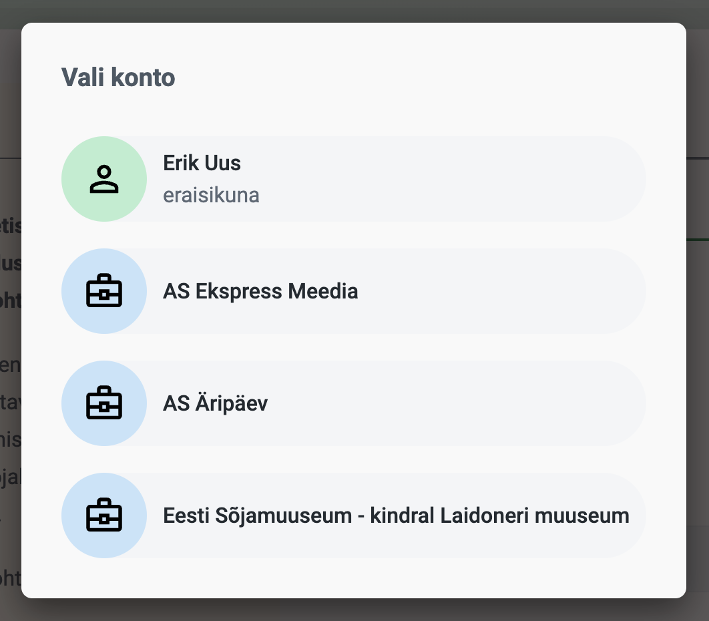

# Kasutaja asutuste sirvimine

## <mark style="color:green;">GET</mark> ra/company/userCompanyList


```
{{apiBaseUrl}}/ra/company/userCompanyList?token={{accessToken}}&userId={{userId}}
```


Väljastab kliendi kehtivad asutused kasutaja identifikaatori alusel.

VAU-s on kirjeldatud kahte tüüpi asutusi – koostöölepinguga ja garantiikirjaga –, millega saab kliente siduda. Kui klient, kes on seotud mõne asutusega, vormistab tasulise tellimuse (nt säilikutellimuse või arhiivipäringu), peab ta valima, kas tegutseb eraisikuna või asutuse nimel.&#x20;

<figure><figcaption></figcaption></figure>

Klient saab valida kõigi asutuste hulgast, millega ta on seotud, ja mille koostööleping või garantiikiri kehtib.

Asutuse nimel esitatud  tellimusi menetletakse teisiti kui eraisikuna esitatuid.

### Parameetrid (query params)

\*-ga märgitud on kohustuslikud

<table><thead><tr><th width="123">NIMI</th><th width="106">TÜÜP</th><th>SELGITUS</th><th data-hidden></th></tr></thead><tbody><tr><td>token *</td><td>String</td><td><a data-mention href="../../juurdepaeaesukood.md">juurdepaeaesukood.md</a></td><td></td></tr><tr><td>userId *</td><td>Integer</td><td>Kasutaja identifikaator</td><td></td></tr></tbody></table>

### Päringu näide (cUrl)


```shell
curl --location --request 
GET 'https://www.ra.ee/vau/index.php/api/ra/company/userCompanyList?token=3d1140862f01aa039322ca47c60a15a8&userId=3' \
```


### Vastuse näide

Asutuste väljastamine õnnestub.&#x20;

```json
{
    "responseStatus": "ok",
    "userCompanyListView": [
        {
            "id": 4,
            "name": "AS Ekspress Meedia"
        },
        {
            "id": 8,
            "name": "AS Äripäev"
        }
    ]
}
```

### Veateade

**error 11011** - kasutajat ei leitud (määratud identifikaatoriga kasutajat andmebaasis ei ole)

```json
{
    "responseStatus": "error",
    "errorCode": 11011,
    "errorMessage": "The given user does not exist"
}
```


Pane tähele, et selles näites "responseStatus" on "error", aga vastuse "HTTP response status code" on "200 OK".

