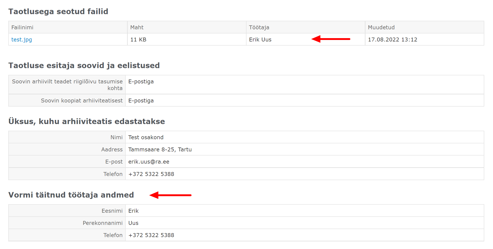

# Töötaja

E-arhiiviteatise **** taotluse loomisel **** tuleb määrata, milline Sotsiaalkindlustusameti töötaja selle koostas. Taotluse koostanud töötaja kontaktandmeid kuvatakse taotluse detailvaate juures. Kui Rahvusarhiivi töötajal, kes taotlust menetleb, tekib küsimusi taotluse andmete kohta, saab ta kontaktandmete alusel võtta ühendust Sotsiaalkindlustusameti töötajaga.

Samuti tuleb manuse lisamisel taotlusele määrata, milline töötaja selle lisas.

**Veebirakenduse ekraanivaade**

<figure><figcaption></figcaption></figure>

## Päringud


[testimine.md](testimine.md)



[toeoetaja-loomine.md](toeoetaja-loomine.md)



[toeoetaja-muutmine.md](toeoetaja-muutmine.md)



[toeoetaja-vaatamine.md](toeoetaja-vaatamine.md)



[toeoetajate-sirvimine.md](toeoetajate-sirvimine.md)



[toeoetaja-leidmine.md](toeoetaja-leidmine.md)



[toeoetaja-kustutamine.md](toeoetaja-kustutamine.md)

