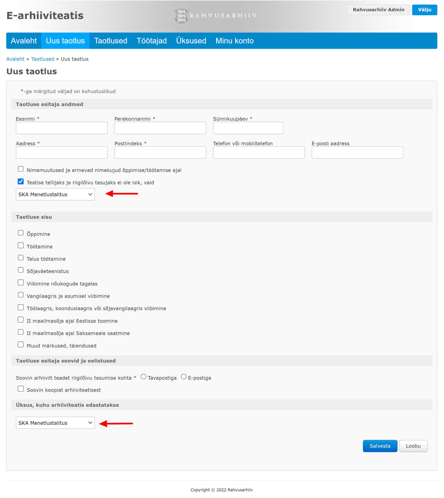
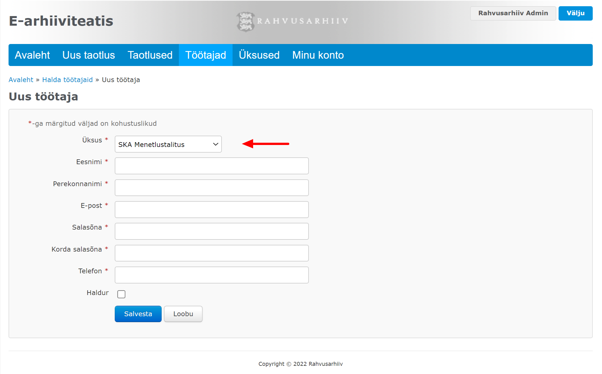

# Üksus

E-arhiiviteatise **** taotlusel **** tuleb kahes kohas määrata Sotsiaalkindlustusameti üksus:

* Juhul kui teatise tellijaks ja riigilõivu tasujaks ei ole isik, vaid Sotsiaalkindlustusameti üksus, tuleb taotlust luues määrata, milline üksus.
* Iga taotluse puhul tuleb määrata üksus, kuhu arhiiviteatis meilitsi edastatakse.

Samuti tuleb iga töötaja puhul määrata, millisesse üksusesse ta kuulub.

**Veebirakenduse ekraanivaated**

 

## Päringud


[testimine.md](testimine.md)



[ueksuse-loomine.md](ueksuse-loomine.md)



[ueksuse-muutmine.md](ueksuse-muutmine.md)



[ueksuse-vaatamine.md](ueksuse-vaatamine.md)



[ueksuste-sirvimine.md](ueksuste-sirvimine.md)



[ueksuse-leidmine.md](ueksuse-leidmine.md)



[ueksuse-kustutamine.md](ueksuse-kustutamine.md)

